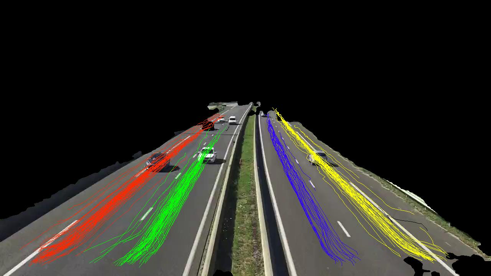

# Traffic monitoring system for counting incoming and outgoing vehicles

---

<!-- paginate: true -->

## Implementation demonstration

<video src="../outputs/cyberpunk.mp4" controls width="80%">

---

## System overview

graph LR
    subgraph Legend
        direction TB
        imp[Implemented]
        nimp{{Not implemented}}
    end
    input[Video feed]
    subgraph Offline
        direction LR
        roadplane[Road plane detection]
        lane{{Lane detection}}
        calib{{Sensor calibration}}
    end
    subgraph Online
        direction LR
        detect[Vehicle detection]
        track[Vehicle tracking]
        count[Vehicle counting]
        dir[Direction estimation]
        speed{{Speed estimation}}
    end
    output[(Tracks DB)]
    input --> Offline
    input --> detect
    roadplane --> detect
    lane --> count
    lane --> dir
    detect --> track
    track --> dir
    track --> count
    track --> speed
    calib --> speed
    dir --> output
    count --> output
    speed --> output

---

## Road plane segmentation

Well-researched topic with many both real-time and slower-than-real-time approaches.

###### Panoptic segmentation model
<video src="../outputs/cyberpunk.mp4" width="100%"></video>
I'm using a _SegFormer_ model from 🤗

###### Dataset

trained on _Cityscapes_ dataset.

---

## Road plane segmentation

### 💣🤯😭 Licences 😭🤯💣

**SegFormer** (https://github.com/NVlabs/SegFormer/blob/master/LICENSE)
> 3.3 Use Limitation. The Work and any derivative works thereof only may be used or intended for use non-commercially. Blah blah ...

**Cityscapes** (https://www.cityscapes-dataset.com/license/)
> Blah blah ... you may not use the dataset or any derivative work for commercial purposes as, for example, licensing or selling the data, or using the data with a purpose to procure a commercial gain. Blah blah goes on...

**Bottom line**: Need to be careful with the choice of the model and dataset.

---

## Interlude: lane detection

- Could (and should) be the same segmentation model. *BDD100K* dataset includes lane annotations.
- Alternatively, lanes can be inferred from vehicle trajectories themselves. **Gotchas**:
    - Large memory footprint: stores all trajectories in memory.
    - Not real-time: uses clustering.
    - Unclear assignment in case of lane changes.

_Almost all vehicle trajectories correctly clustered into 4 groups by lanes they use_

---

## Vehicle detection and tracking

- Basically a solved problem.
- Plethora of freely available models and datasets.
- Porting to different hardware is easy.
 

The implementation uses **YOLOv8n** model from Ultralytics trained on **COCO** dataset which includes cars, trucks, buses, etc.
MOT is performed using **ByteTrack**: good balance between speed and accuracy.

---

## Counting, direction and speed estimation

- **Counting** is supported by the tracking algorithm.
    - The algorithm assigns a unique ID to each detection.
    - Discarding spurious detections by enforcing minimum length of the trajectory (in number of frames).
     
- **Direction** is estimated by comparing the first and the last position of the trajectory.
    - Assumes that the directions can be differentiated by either the X or Y axis.
    - More robust approach uses the info about the lane the vehicle is in.
     
- For **speed estimation** depth estimation is the king.

---

## Counting, direction and speed estimation

###### Speed estimation

- Requires additional **knowledge** about the environment:
    - Camera in-/extrinsics
    - Scene depth
    - Reference object size for scale (optional)
- Or additional **hardware**:
    - Stereo camera
    - Radar/laser sensor

###### Monocular depth estimation

*3D Packing for Self-Supervised Monocular Depth Estimation (CVPR 2020, oral)*

---

## Counting, direction and speed estimation

Recent advances in monocular depth estimation: **Towards Zero-Shot Scale-Aware Monocular Depth Estimation (ICCV 2023)** by Toyota Research Institute (https://arxiv.org/abs/2306.17253)

> In this work we introduce ZeroDepth, a novel monocular depth estimation framework capable of predicting metric scale for arbitrary test images from different domains and camera parameters. ... achieved a new state-of-the-art in both settings using the same pre-trained model, outperforming methods that train on in-domain data and require test-time scaling to produce metric estimates

